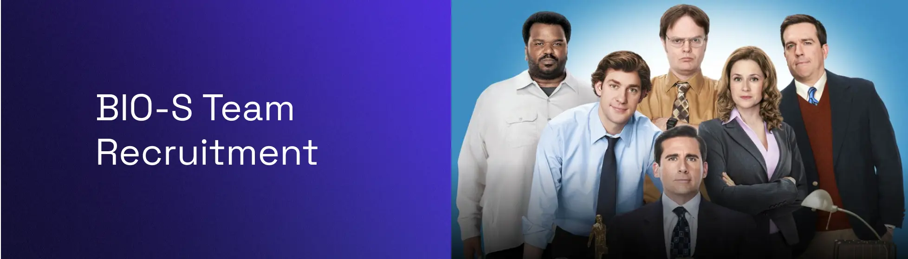

# BIO-S Team Recruitment Website

BIO-S Community is a student-led organization based in Nashik, India, that is committed to promoting open-source culture, hackathons, and community building among students. With around 250 members, the community operates mainly through its Discord platform, providing a space for students to collaborate, network, and learn from one another. Despite being based in Nashik, BIO-S welcomes members from all around the world, creating a diverse and inclusive community for all tech enthusiasts. The community has organized its own events and actively participates in programs such as MLH Global Hack Week. This allows members to showcase their skills, share their ideas, and engage with the latest developments in technology. By being a part of BIO-S, students can gain valuable experience and be a part of a vibrant and growing community of tech-savvy individuals.

We are recruiting core team members, and you can apply to be a part of this budding community. Well, why should you join in and work for an open-source community? You’ll get the following perks!

**Visit the [team recruitment website](https://bios-community.github.io/team/) for more information.**

## Perks of joining the team

- [x] You’ll get to work with a team of like-minded individuals who are passionate about open-source and community building.
- [x] Monthly mentorship from Tech Industry leaders.
- [x] You will have the opportunity to serve as a volunteer or perhaps a core team member in the majority of offline events hosted by the BIO-S Community or Adarsh Dubey.

## How to apply?

You can fill out the [application form](https://k0c2cs6383a.typeform.com/to/qwclfSmo) to apply for the team. We will review your application and get back to you as soon as possible.

Or simply visit the [website](https://bios-community.github.io/team/).

## Support

If you have any questions, you can contact [Adarsh Dubey](https://bio.link/inclinedadarsh).
